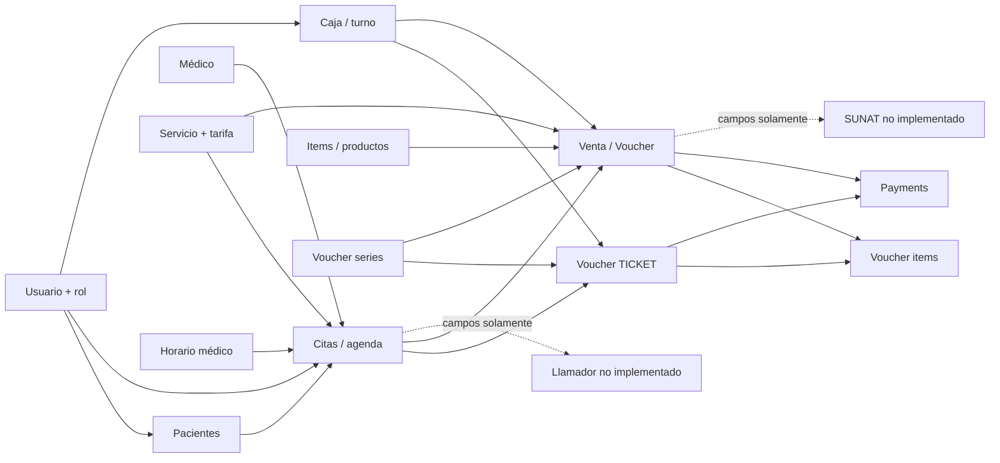

# Mapa de dependencias ERP CEO Salud

## 1. Vista de contexto AS-IS



Las flechas discontinuas representan preparación o intención, no integración operativa demostrada.

## 2. Dependencias por flujo

### 2.1 Registro de paciente

```text
Usuario autenticado/rol
  → PatientController + patient.js
  → búsqueda patients
  → si no existe: ReniecService → proveedor DNI
  → patients
  → opcional: responsibles
  → channels / interaction_media
```

Dependencias fuertes:

- La historia clínica depende del orden de `patients.id` y de una suma no atómica.
- Canal/medio están en el paciente, aunque comentarios/relaciones sugieren citas.
- Responsable se persiste junto al flujo, pero sin transacción común.

### 2.2 Cálculo y reserva de cita

```text
Patient
  → Specialty
  → Doctor
  → DoctorService
  → Service
  → AdditionalRate
  → DoctorSchedule
  → disponibilidad calculada contra Appointment
  → Appointment
```

Si hay adelanto:

```text
Appointment
  → CashierShift abierto del usuario
  → VoucherSerie TICKET (lock)
  → Voucher
  → VoucherItem polimórfico a Appointment
  → Payment
```

Puntos de propagación:

- Cambiar servicios/tarifas impacta cita, reconsulta, venta, voucher item e impuesto.
- Cambiar agenda/estado impacta disponibilidad, dashboard y posible llamador.
- Cambiar pagos de cita exige reconciliar campos de `appointments`, voucher y payments.

### 2.3 Atención/llamador

```text
Appointment.estado_cita
Appointment.hora_llegada
Appointment.hora_llamado
Appointment.hora_atencion
Appointment.hora_atendido
        ⇢ no hay comandos/rutas/eventos completos
```

Una futura integración afectará privacidad, autenticación entre aplicaciones, disponibilidad de datos, scheduler/queue, dashboard y estados de cita. No debe acoplarse directamente a la tabla sin contrato de eventos.

### 2.4 Venta y cobro

```text
CashierShift abierto
  → paciente atendido / pagador / RUC
  → Item | Service | Appointment | Ticket pendiente
  → carrito Livewire
  → cálculo IGV
  → VoucherSerie (lock)
  → Voucher
  → VoucherItems
  → Payments
  → decremento Item.stock_actual
  → impresión HTML
```

Acoplamientos críticos:

- `Sales` conoce búsqueda, pricing, deuda, documento, SUNAT preparado, stock, comisiones, pago e impresión.
- `voucher_items.item_type` enlaza a tres modelos mediante morph map, sin FK al origen.
- Un ticket padre se marca pagado al crear hijo, pero no hay concepto separado de obligación/aplicación.
- El saldo de voucher es suma dinámica de payments; el saldo de appointment es columna independiente.

### 2.5 Caja

```text
Cashier
  → CashierShift(user)
      ├─ Payments en efectivo
      ├─ CashMovements INGRESO
      ├─ CashMovements EGRESO
      └─ Vouchers (resumen ventas)
  → monto sistema
  → contado
  → diferencia / cierre
```

Dependencias:

- La integridad del cierre depende de que pagos/movimientos no cambien después.
- Las anulaciones/devoluciones futuras deben reflejarse en caja sin borrar historia.
- Sede/punto de venta condicionará caja y series.

### 2.6 Documento tributario

```text
Catálogo fiscal + cliente + venta + serie/correlativo
  → Voucher con requiere_sunat/estado_sunat
  → impresión HTML
  ⇢ faltan XML, firma, envío, CDR, reintento, baja y consulta
```

La emisión depende de decisiones contables, organización/sedes, catálogo tributario, venta canónica, pagos y custodia documental. Por eso SUNAT no debe implementarse antes de estabilizar esos dominios.

## 3. Dependencias de datos

| Fuente | Dependientes directos | Riesgo al cambiarla |
|---|---|---|
| `users`/roles | pacientes, citas, turnos, vouchers, payments, movements, rutas | Perder actor histórico o acceso si usuario y trabajador se migran sin mapeo. |
| `patients` | responsables, citas, vouchers (atendido/pagador), RENIEC | PII y duplicados se propagan a agenda y documentos. |
| `doctors` | horarios, citas, doctor_services, voucher_items | Rediseñar profesional exige conservar referencias históricas. |
| `services` | citas, doctor_services, búsqueda de ventas, voucher item morph | Unificación con catálogo comercial cambia pricing e historial. |
| `doctor_services` | precio/reconsulta, cita, búsqueda venta | Falta de unicidad puede dar múltiples precios para la misma oferta. |
| `doctor_schedules` | disponibilidad y alta de cita | Recurrencia/excepciones deben migrarse sin abrir slots falsos. |
| `appointments` | calendarios, dashboard, ticket, venta de cita, llamador futuro | Es el mayor agregado acoplado: agenda + atención + finanzas. |
| `cashier_shifts` | vouchers, payments, movements, cierre | Una corrección de turno afecta todo el ledger operativo. |
| `voucher_series` | alta de adelanto y venta | Alcance por caja/sede/tipo determina unicidad legal. |
| `vouchers` | líneas, pagos, impresión, padre/hijos, SUNAT futuro | Hoy representa más de un concepto; migración necesita reconciliación. |
| `voucher_items` | venta histórica, comisión, origen cita/item/service | El morph puede apuntar a registros cambiados o inexistentes. |
| `payments` | saldo de voucher y efectivo de caja | No sincroniza appointment y no tiene reversos. |
| `items` | búsqueda venta, stock, impuestos, seeder | Unificación con services/inventario afecta precios y ventas históricas. |

## 4. Dependencias de código y UI

| Componente | Dependencia oculta o fuerte |
|---|---|
| `RouteServiceProvider` + `web.php` | Cargan tres archivos de rutas dos veces. |
| Vistas ADMINISTRADOR/RECEPCION | Incluyen parciales de ADMISION con formularios de escritura. |
| JS de admisión | Se reutiliza por todos los roles y usa URLs absolutas hardcodeadas. |
| `AppointmentController` | Crea cita, calcula estado de pago, exige caja y crea ticket/pago. |
| `ScheduleController` | Agenda, disponibilidad, edición de cita y CRUD de horario en una clase. |
| `Sales` | RUC, pacientes, catálogo, citas, deuda, venta, impuesto, stock, series, pagos y vouchers. |
| `DashboardController` | Duplica consultas de citas/reevaluaciones del controlador de citas. |
| `SunatService` | Su nombre sugiere facturación, pero solo consulta RUC. |
| `MailAppointment` | Remitente y canal acoplados; llamada comentada dentro de controller. |

## 5. Mapa de impacto de decisiones

| Decisión | Módulos afectados |
|---|---|
| Una o varias sedes | personal, permisos, médicos, agenda, caja, series, inventario, SUNAT, reportes. |
| Modelo persona/trabajador/usuario | autenticación, pacientes, médicos, auditoría, caja y documentos. |
| Pago antes/durante/después de atención | citas, atención, ventas, deuda, pagos, caja y llamador. |
| Definición de reconsulta | doctor-service, pricing, citas, atención y reportes. |
| Catálogo único | services, items, doctor_services, sales, voucher_items, stock e impuestos. |
| Documentos SUNAT | venta, cliente, series, impuestos, pagos, notas, storage, queue y cron. |
| Alcance de inventario | catálogo, venta, almacenes, compras, costo y reportes. |
| Contrato del llamador | estados de cita, privacidad, API, eventos, pantalla y resiliencia. |

## 6. Orden técnico derivado de dependencias

```text
Decisiones estructurales
        ↓
Glosario + estados + permisos + organización
        ↓
Perfilado/reconciliación de datos productivos
        ↓
Persona/trabajador/profesional + catálogos canónicos
        ↓
Agenda/disponibilidad/cita/atención
        ↓
Venta/deuda/pago/caja/documento interno
        ↓
Inventario (si aplica) y documento tributario
        ↓
Llamador/notificaciones/SUNAT/reportes
        ↓
Optimización UX
```

El orden evita construir integraciones o pantallas sobre estados y fuentes de verdad todavía ambiguos.

## 7. Cortes seguros para una futura implementación

1. **Corte de seguridad/contratos:** rutas únicas, requests, policies y UI coherente; sin cambiar datos.
2. **Corte de integridad inmediata:** validar IDs/importes, constraints de negocio y locks en MySQL aislado.
3. **Corte de identidad:** mapear persona/trabajador/profesional sin romper actores históricos.
4. **Corte de agenda:** fuente única de disponibilidad y estados; adaptar llamador después.
5. **Corte financiero:** reconciliar y separar venta, obligación, pago y caja antes de SUNAT.
6. **Corte fiscal/integraciones:** adaptadores idempotentes con queue/outbox y sandbox.

Cada corte necesita métricas de reconciliación, pruebas de regresión y plan de rollback antes de tocar producción.
